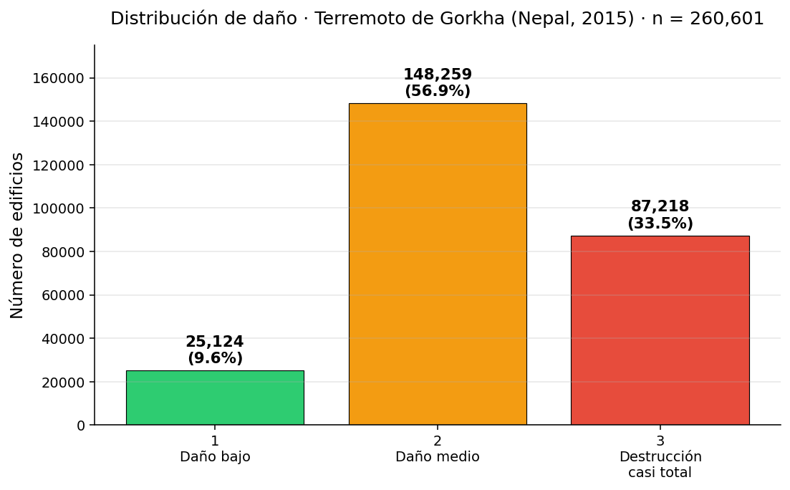

# Día 1 / 30 — EDA + 2 baselines

> **Reto:** [Richter's Predictor](https://www.drivendata.org/competitions/57/nepal-earthquake/) (DrivenData)
> **Objetivo:** Predecir el grado de daño (1 / 2 / 3) de 260k+ edificios de Nepal tras el terremoto de Gorkha (2015) a partir de cómo estaban construidos.
> **Métrica:** F1 micro-averaged.

## Qué hice hoy

1. **EDA mínimo.** Cargar los CSVs, comprobar shapes, revisar la distribución de clases.
2. **Baseline trivial.** Predecir siempre la clase mayoritaria. Esto fija el suelo: si un modelo no la supera, no aporta nada.
3. **Baseline LightGBM out-of-the-box.** Sin tuning, sin feature engineering, sin imputación — solo categóricas como `category` y al horno. 5-fold StratifiedKFold para tener una estimación honesta.

## Datos

| | Filas | Columnas |
|---|---|---|
| `train_values` | 260,601 | 39 (incluye `building_id`) |
| `train_labels` | 260,601 | 2 |
| `test_values` | 86,868 | 39 |

**38 features** después de quitar `building_id`:
- 8 numéricas continuas (geo IDs jerárquicos, `age`, `count_floors_pre_eq`, `area_percentage`, `height_percentage`, `count_families`).
- 8 categóricas (`foundation_type`, `roof_type`, etc.).
- 22 binarias (11 tipos de superstructure + 11 secondary uses).

## Distribución del target



| `damage_grade` | Significado | Frecuencia |
|---|---|---|
| 1 | Daño bajo | **9.64%** |
| 2 | Daño medio | **56.89%** |
| 3 | Destrucción casi total | **33.47%** |

Dataset desbalanceado pero no extremo. La clase mayoritaria (2) marca el suelo.

## Resultados

| Baseline | CV local (5-fold) | Público (DrivenData) | Δ |
|---|---|---|---|
| Predecir siempre `2` | **0.5689** | **0.5670** | -0.0019 |
| LightGBM out-of-the-box | **0.7182 ± 0.0009** | **0.7179** | -0.0003 |

**El gap CV ↔ público es prácticamente cero** (-0.0003 en el LightGBM, dentro del σ de CV). Eso significa que el setup de validación está bien calibrado — durante los próximos 29 días puedo confiar en la CV local sin quemar submits para comparar experimentos. La diferencia de 0.0019 en el baseline trivial refleja que la clase 2 representa 56.70% del test vs 56.89% del train: una pizca menos.

CV extremadamente estable (σ ≈ 0.001). Cualquier mejora futura > 2σ ≈ 0.002 ya es probablemente señal real, no ruido.

## Notas honestas

- LightGBM 4.x trata las columnas `category` de pandas nativamente — no hace falta one-hot encoding ni target encoding para empezar. El que sea óptimo es otra discusión (los `geo_level_*_id` tienen miles de niveles y van a necesitar tratamiento específico).
- 0.7179 público con un modelo sin tuning sugiere que las features brutas ya tienen mucha señal — la batalla del mes va a ser exprimir el último 5-7% (top del leaderboard ronda 0.75).
- El leaderboard público es solo una parte del test set (el privado se revela al final, si fuera una competición con premio). En "practice" no hay esta distinción, pero el principio de no overfittear a un solo número se aplica igual.

## Iteración 2 — forzando el score

Después de subir los baselines y ver el score público (0.7179), enseguida quedó claro que **los `geo_level_{1,2,3}_id` se estaban tratando como enteros ordinales**. Con 31 / 1.414 / 11.595 niveles únicos respectivamente, eso es absurdo: la aldea con id=12.345 no es "mayor" que la 12.344, simplemente es otra. LightGBM debería tratarlas como categorías y buscar splits agrupando niveles.

Cadena de 4 experimentos en [iterate.py](iterate.py), todos sobre los **mismos folds** (StratifiedKFold seed=42) para que los deltas sean comparables:

| Exp | Cambio | F1 micro (CV) | Δ vs E1 |
|---|---|---|---|
| E1 | Parity check del baseline (geos como `int`) | 0.7182 ± 0.0009 | — |
| **E2** | **+ `geo_level_*_id` como `category`** | **0.7488 ± 0.0016** | **+0.0306** ⭐ |
| E3 | + `n_estimators=2000` con early stopping | 0.7489 ± 0.0016 | +0.0307 |
| **E4 (submitido)** | **+ `num_leaves=127`, `lr=0.03`, fractions=0.85** | **0.7497 ± 0.0012** | **+0.0315** 🏆 |

**Score público confirmado:** E4 = **0.7488** (CV 0.7497, Δ -0.0009). Rank 491 sobre ~8.800 participantes ≈ top 5.6%.

El gap CV→público creció (-0.0003 en el baseline, -0.0009 en E4). Sigue siendo pequeño pero 3× mayor — coherente con E4 teniendo más capacidad (num_leaves=127 vs 31 por defecto). El público de E4 ≈ CV de E2 → **el tuning fino no generalizó del todo**. Implicación para mañana: no perseguir hyperparams sin atacar antes el cuello de botella real (calidad/cantidad de señal, no capacidad del modelo).

**Lecciones:**

- **E2 es el cambio que importa.** +0.0306 ≈ 30σ → completamente real. El modelo del primer baseline dejaba la mitad de la señal sobre la mesa.
- **E3 ≈ E2.** `best_iter` medio = 205, así que `n_estimators=300` del baseline ya estaba bien dimensionado. No estaba undertrained.
- **E4 suma +0.0008** sobre E3 — significativo (>2σ del CV) pero modesto. Tuning fino solo mueve la aguja una vez tapada la fuga gorda.

Submission del ganador (E4 entrenado en train completo): [submissions/best_iterate.csv](submissions/best_iterate.csv).

**Sesgo del modelo en la predicción del test:**

| Clase | Real (train) | Predicho (test) |
|---|---|---|
| 1 | 9.64% | 8.18% |
| 2 | 56.89% | 63.11% |
| 3 | 33.47% | 28.71% |

El modelo está sobrepoblando la clase 2 (la mayoritaria). Posible knob para más adelante: `class_weight="balanced"` o calibración + thresholds.

## Iteración 3 — Ensemble LightGBM + CatBoost

Hipótesis: CatBoost maneja categóricas de alta cardinalidad (los 11.595 `geo_level_3_id`) con un algoritmo distinto al de LightGBM (ordered target encoding con permutaciones para evitar leakage). Aunque su score absoluto sea peor, sus predicciones pueden estar lo bastante decorreladas como para que la **media de probabilidades** suba sobre el mejor individual.

Comparativa sobre los **mismos folds** (StratifiedKFold seed=42) que las iteraciones anteriores:

| Modelo | F1 CV (5-fold) | Notas |
|---|---|---|
| LightGBM E4 (parity) | 0.7498 ± 0.0016 | Igual que iter. 2 con seed=42 |
| CatBoost (depth=6, ~290 iter) | 0.7443 ± 0.0017 | Lighter setup por tiempo de CPU |
| **Ensemble (media de probabilidades)** | **0.7518 ± 0.0019** | **+0.0020 sobre LGBM solo (~1.25σ)** |

CatBoost solo es **peor** que LightGBM aquí (probablemente subiría a ~0.749 con `depth=8` + más iters, pero más tiempo de CPU). Aun así, el ensemble **sí supera al mejor individual** por +0.0020 — esa es la prueba empírica de que los dos modelos están viendo cosas distintas en los datos (sus errores no están totalmente correlacionados).

Submission ensemble en [submissions/ensemble_lgb_cb.csv](submissions/ensemble_lgb_cb.csv).

**Score público confirmado: 0.7510** (CV 0.7518, Δ -0.0008). +0.0022 sobre E4 (CV predijo +0.0020 → calibración casi exacta). **Rank 280 sobre ~8.800 participantes ≈ top 3.2%** (salto de 211 puestos desde E4).

## Iteración 4 — Target encoding OOF (NEGATIVO)

Hipótesis: si codifico cada `geo_level_*_id` por la proporción de cada clase de daño (calculada OOF para no leakear), debería ayudar al modelo más que la categoría nativa.

Probé con dos niveles de smoothing bayesiano (m=20 y m=5):

| Setup | F1 CV |
|---|---|
| E4 baseline (geo como `category` solo) | 0.7498 |
| E4 + 9 features TE (geo_1,2,3 × 3 clases), m=20 | 0.7470 |
| Mismo, m=5 | 0.7470 |

**Negativo en ambos casos:** -0.0028. Cambiar el smoothing no movió nada.

**Lectura:** LightGBM con `astype("category")` ya está haciendo internamente algo equivalente al target encoding cuando explora splits sobre 11.595 niveles. Añadir TE explícito no aporta información nueva — solo ruido + posible overfit por el leakage residual del fit-en-train.

El top-28 sí mejora con TE/embeddings, pero usa **embeddings densos vía red neuronal supervisada** (no proporciones simples). Esa es una palanca distinta y más cara.

## Iteración 5 — Feature engineering con agregaciones (POSITIVO)

Pivot tras la negativa del target encoding: en vez de codificar la variable objetivo por aldea, agregar **otras features** por aldea. Eso da información que el árbol no puede calcular solo (necesitaría agrupar filas) y no implica leakage (no toca `y`).

18 features nuevas:
- **Sobre aldea (`geo_level_3_id`):** count, mean age, mean floors, mean area, mean height, mean families, % adobe-mud, % mud-stone, % RC engineered, % timber.
- **Sobre distrito (`geo_level_2_id`):** count, mean age, mean floors.
- **Domain features:** `n_superstructure_types`, `volume_proxy` (area × height), `age_per_floor`, `age_minus_geo3_mean`, `floors_minus_geo3_mean` (este edificio comparado con la media de su aldea — un edificio "viejo para su aldea" puede ser señal específica).

| Modelo | Features | F1 CV |
|---|---|---|
| E4 (sin feat eng) | 38 | 0.7498 ± 0.0016 |
| **It. 5 (con agregaciones)** | **56** | **0.7510 ± 0.0010** |

**Δ = +0.0012** (1.2σ del CV → señal real). σ del CV baja también de 0.0016 a 0.0010 → el modelo es más estable. Submission en [submissions/lgbm_feateng.csv](submissions/lgbm_feateng.csv).

## Siguiente paso

- Submit `lgbm_feateng.csv` para confirmar score público.
- **Nuevo ensemble** con el LightGBM mejorado (feateng) + CatBoost — esperado ~0.752-0.753 en CV.
- Beefier CatBoost (`depth=8`, 1000 iters) para subir su componente del ensemble.
- Análisis de errores fino.

## Reproducir

```powershell
pip install pandas numpy scikit-learn lightgbm matplotlib
python day_01\day01.py        # baselines del Día 1
python day_01\iterate.py      # cadena de 4 experimentos (~15-20 min CPU)
python day_01\finalize.py     # solo retraining del ganador + submission (~1-2 min)
```

Outputs:
- `class_distribution.png` — plot del Día 1
- `submissions/baseline_majority.csv` — predecir siempre clase 2
- `submissions/baseline_lgbm.csv` — LightGBM out-of-the-box (F1 público = 0.7179)
- `submissions/best_iterate.csv` — E4 (F1 CV = 0.7497, público pendiente)
